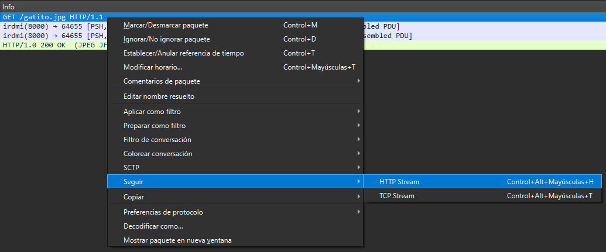
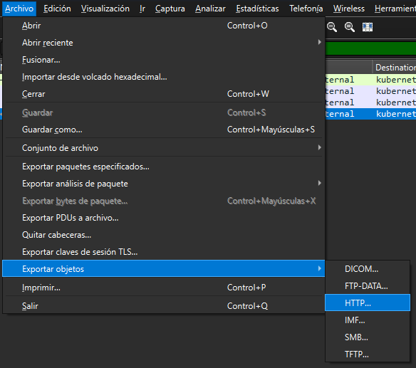

# 🎯 Charla CTF: Proyecto Matrioska - En Busca de "El Fantasma"

Este proyecto contiene toda la infraestructura y los archivos necesarios para desplegar un entorno de ciberseguridad tipo "Matrioska". A diferencia de los retos aislados tradicionales, este CTF está diseñado como una narrativa lineal: la solución de cada categoría es la llave de entrada exacta para la siguiente.

Las disciplinas que cubriremos en vivo incluyen: **OSINT, Explotación Web, Análisis de Red (Forensics), Esteganografía y Criptografía/Misc.**

---

## 🚀 Punto de Partida para los Asistentes

Si estás participando en la charla o quieres intentar el reto por tu cuenta, **no mires el código de este repositorio todavía** (¡contiene spoilers y las respuestas finales!).

Tu investigación comienza aquí, en el repositorio filtrado del desarrollador objetivo:<br>
👉 **[https://github.com/daaroo8/project-spectre](https://github.com/daaroo8/project-spectre)**

Encuentra la vulnerabilidad y tira del hilo. ¡Buena suerte!

Flag format: 47CON{...}

---

## 📁 Estructura del Proyecto

Para quien quiera desplegar el reto en local, esta es la estructura del proyecto (construido de adentro hacia afuera):
```text
CHARLACTF/
├── .dist/                  # Directorios y configuraciones de entorno local
├── CTF-Web/                # Entorno vulnerable principal (Fase Web)
│   ├── docker-compose.yml  # Configuración para levantar Apache/PHP
│   └── web/                # Archivos del servidor web
│       ├── admin/          # Directorio oculto
│       │   ├── captura.pcap # Evidencia de red para descargar
│       │   └── index.php
│       ├── home.php        # Panel tras el bypass
│       ├── index.php       # Portal de Login (Vulnerable a SQLi)
│       └── robots.txt      # Pista de exclusión
├── archivo.js              # Payload final ofuscado (JSFuck / Crypto)
├── captura.pcap            # Archivo de red crudo (Contiene la imagen)
├── gatito.jpg              # Imagen portadora (Contiene el archivo.js)
└── README.md               
```

## 🛠️ Requisitos e Instalación

Para levantar este escenario en tu propia máquina y seguir el rastro de "El Fantasma", necesitarás tener instaladas las siguientes herramientas:

* **Docker & Docker Compose** (Para levantar la infraestructura web).
* **Git** (Para la fase de OSINT).
* **Wireshark** (Para el análisis forense de red).
* **Steghide** (Para la extracción esteganográfica).

### Instrucciones de Despliegue:

1. Clona este repositorio en tu máquina local. `git clone https://github.com/daaroo8/CharlaCTF`.
2. Navega hasta el directorio del servidor web: `cd CTF-Web`.
3. Otorga los permisos necesarios para que el contenedor pueda leer los archivos: `sudo chmod -R 755 web/`.
4. Levanta el contenedor: `sudo docker compose up -d`.
5. La aplicación web vulnerable estará disponible en `http://127.0.0.1`.

> **Nota para apagar el entorno:** `sudo docker compose down`

---

## 📝 Write-Up (Solución Paso a Paso)

### 1. **OSINT**
  El CTF comienza con un repositorio de github. <br>
  En este tipo de retos, en los que se nos presenta un repositorio, lo más frecuente es revisar los commits, en busca de mensajes sospechosos como *fix: all passwords hidden* o similares, ya que pueden presentar claras pistas de la vulnerabilidad a la que se enfrentan. <br>
  Para ello ejecutamos `git log -p` y revisando cuidadosamente vemos:
  ```text
  +{
  +  "environment": "staging",
  +  "debugMode": true,
  +  "apiEndpoint": "http://127.0.0.1",
  +  "authMethod": "token"
  +}
  ```
  Dado que es un entorno local (*una charla de iniciación en el mundo de los CTFs*), podemos tomar esta IP como pista.

### 2. **Web**
  En los retos de web, existen infinidad de vulnerabilidades diferentes. En este reto nos centramos en dos **SQLi** y **Revelación de Información**. <br>
  * **SQLi**: este sistema es vulnerable frente a SQLi. Una SQLi permite modificar la query (*llamada a la base de datos*) con lo que nosotros queramos. Por ejemplo, si el sistema valida la información con: <br>
  `SELECT * FROM users WHERE username = '$user' AND password = '$pass'";` <br>
  Lo que nosotros vamos a hacer es romper esa query y que se ejecute algo que siempre es cierto como por ejemplo `1=1`. En el campo de usuario escribiremos lo siguiente:<br>
  `' OR 1=1 --`. 
    * `'`: Para cerrar el campo de `'$user'`.
    * `OR 1=1`: Condición que siempre es cierta.
    * `--`: Para comentar todo lo que venga por detrás. <br>
  Con esto habríamos *bypasseado* el login y autenticados en la web.

  * **Revelación de Información**: En muchas webs, por fallo humano queda público un archivo llamado `robots.txt` que sirve para decirle a los rastreadores de los motores de búsqueda (como los bots de Google) qué partes de la página web no deben visitar ni mostrar en sus resultados de búsqueda.<br>
  En muchos casos, el error humano provoca que este archivo quede público y accesible, dejando a la vista pistas sobre directorios ocultos en la web. En este caso podemos ver en `http://127.0.0.1/robots.txt`:
  ```text
  User-agent: *
  Disallow: /admin/
  ```
  Esto nos da una pista de la existencia de un directorio `/admin`. <br>
  Accediendo a `http://127.0.0.1/admin` podemos ver un archivo `.pcap` muy llamativo.

### 3. **Forensics / Análisis de Red**

En los retos de forensics en los cuales las fuentes son `.pcap` o similares. Lo principal es abrir **Wireshark**. Desde ahí, probaremos diferentes filtros, observaremos paquetes que resulten llamativos y los seguiremos, revisar los ttl de paquetes ICMP... <br>
En este caso, para evitar perder mucho tiempo en esto, la captura ya presenta los paquetes filtrados, observándose un `GET /gatito.jpg HTTP/1.1`.<br><br>


Lo que cualquier jugador de CTFs haría sería guardar los datos de la ventana que se abre como Raw. Lo cual es un error, ya que un visor de imágenes no podrá abrirlo ya que espera una cabecera para `.jpg`, `.png`... Y en realidad se está encontrando con un texto HTTP. <br>
Para ello, Wireshark tiene la opción de descargar el archivo sin las cabeceras HTTP: <br><br>


Descargamos la imagen `gatito.jpg`.

### 4. **Stego**

En retos de Stego, existe una pequeña guía para revisar todo: 
  1. `file image.jpg`: para revisar que efectivamente se trate de un `.jpg` y no de otra cosa.
  2. `exiftool image.jpg`: para revisar los metadatos del archivo en busca de pistas.
  3. `strings image.jpg`: en busca de cadenas de texto ocultas en la imagen como podrían ser flag, password...
  4. `binwalk -e imagen.jpg`: para buscar y extraer cualquier otro archivo reconocido.
  5. `steghide extract -sf gatito.jpg [-p ""]`: en busca de datos cifrados.
  6. En caso de que fuese un `.png` es frecuente esconder información en los LSB (*least significant bits*).
  7. Si nada de lo anterior funciona, la clave puede estar en lo visual, como variaciones en los píxeles de color. Se pueden probar herramientas como StegSolve.

Para este caso, pasamos toda la checklist hasta:
```text
danie@daaroo8:/CharlaCTF$ steghide extract -sf gatito.jpg -p ""
the file "archivo.js" does already exist. overwrite ? (y/n) y
wrote extracted data to "archivo.js".
```

### 4b. **JSFuck**:

Este `archivo.js` generado está completamente ofuscado.
JSFuck es una forma extrema de ofuscación basada en las debilidades y particularidades del sistema de tipos de JavaScript. <br>
En **[https://jsfuck.com/](https://jsfuck.com/)** podemos abrir la terminal del navegador y ejecutar tal cual el texto de `archivo.js` y podemos ver que nos devuelve: `U1A0P28cMBIcTQQIGhV+EwgoRBYECBlRfg8GARV+ARIZUVw=`


### 5. **Crypto**: 

La categoría de Crypto en un CTF no trata de "hackear un servidor", sino de romper matemáticas.

Para este tipo de retos existe la herramienta **[https://gchq.github.io/CyberChef/](https://gchq.github.io/CyberChef/)** en la cual podemos encadenar diferentes métodos de cifrado para tratar de descifrar nuestras cadenas.

En cualquier reto, todo es una pista, y si recordamos cuando logramos completar la parte de Web, me decían que la flag me la tenía que cocinar yo solito. Y... efectivamente, ahora estamos con **CyberChef**, por tanto, ya sé que cuando resuelva este reto, habré logrado completar este reto.

Cosas que sabemos: 
  * Tener una cadena que presenta: mayúsculas, minúsculas, números e '=', son claras indicaciones de que se trata de una base64.
  * Formato de la flag: 47CON{...}.
  * Propiedades de XOR: 
    * `M`ensaje, `K`ey y `C`ifrado..
    * `M^K = C`
    * `C^K = M`
    * `C^M = K`

| Operación | Fórmula | Utilidad en este Reto |
| :--- | :--- | :--- |
| **Cifrar** | $M$^$K = C$ | El proceso que ocultó la flag original ($M$) usando la clave ($K$). |
| **Descifrar** | $C$^$K = M$ | El proceso estándar para obtener la flag si ya conociéramos la clave. |
| **Recuperar Clave** | $C$^$M = K$ | **Nuestra Estrategia:** Usar el cifrado ($C$) y el formato conocido ($M$) para extraer la clave. |

Para revelar la flag, seguimos una lógica de "despejar la X" utilizando la herramienta **CyberChef**:

1.  **Entrada ($C$):** Introducimos el string en Base64 y aplicamos la receta `From Base64` para obtener los bytes cifrados.
2.  **Texto conocido ($M$):** Sabemos por las reglas del CTF que la bandera comienza con el prefijo `47CON{`.
3.  **Deducción de la Clave:** Al aplicar la receta `XOR` usando `47CON` como llave, la salida nos revela los primeros bytes de la clave real: `ggwp!`. <br><br>

4.  **Resultado Final:** Como el XOR es cíclico, simplemente configuramos la receta `XOR` con la clave completa `ggwp!` para procesar todo el archivo y obtener la flag:  <br><br>


>`47CON{Wellcome_to_47con!_have_fun!}`
  

---

## ⚠️ Aviso Legal

Este entorno ha sido creado con **fines estrictamente educativos y demostrativos** para la comunidad de ciberseguridad. Las vulnerabilidades aquí expuestas (como inyecciones SQL y exposición de credenciales) son intencionadas. No utilices estas técnicas en sistemas sobre los que no tengas autorización explícita.